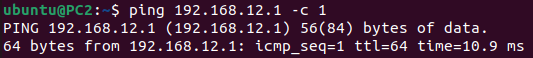

University: [ITMO University](https://itmo.ru/ru/)  
Faculty: [FICT](https://fict.itmo.ru)  
Course: [Introduction in routing](https://github.com/itmo-ict-faculty/introduction-in-routing)  
Year: 2023/2024  
Group: K33212  
Author: Shelyagov Aleksei Sergeevich       
Lab: Lab1  
Date of create: 17.12.2023  
Date of finished: 17.12.2023 

## Лабораторная работ №1 "Установка ContainerLab и развертывание тестовой сети связи"

## Цель работы
Ознакомиться с инструментом ContainerLab и методами работы с ним, изучить работу VLAN, IP адресации и т.д.

## Ход работы   

Развернем сеть в ContainerLab. Перед запуском сети были созданы контейнеры ```ubuntu:latest```(последняя версия Ubuntu) и ```vrnetlab/vr-routeros:6.47.9```(RouterOS-контейнер)
Также, пропишем config-файлы для Mikrotik'ов и скрпты, настрaивающие Ubunt'ы после запуска:

### Файл, конфигурирующий сеть
```
name: test1

mgmt:
  ipv4_subnet: 172.20.20.0/24


topology:
  nodes:
    RO1.TEST:
      kind: vr-ros
      image: vrnetlab/vr-routeros:6.47.9
      mgmt-ipv4: 172.20.20.10
      startup-config: R01.cfg
    PC1:
      kind: linux
      image: ubuntu:latest
      mgmt-ipv4: 172.20.20.21
      binds:
        - setup_ubuntu.sh:/tmp/setup.sh
      exec:
        - bash /tmp/setup.sh
    PC2:
      kind: linux
      image: ubuntu:latest
      mgmt-ipv4: 172.20.20.22
      binds:
        - setup_ubuntu.sh:/tmp/setup.sh
      exec:
        - bash /tmp/setup.sh
    SW01.L3.01.TEST:
      kind: vr-ros
      image: vrnetlab/vr-routeros:6.47.9
      mgmt_ipv4: 172.20.20.11
      startup-config: SW01.cfg
    SW02.L3.01.TEST:
      kind: vr-ros
      image: vrnetlab/vr-routeros:6.47.9
      mgmt-ipv4: 172.20.20.12
      startup-config: SW02.cfg
    SW02.L3.02.TEST:
      kind: vr-ros
      image: vrnetlab/vr-routeros:6.47.9
      mgmt-ipv4: 172.20.20.13
      startup-config: SW02.cfg
  links:
    - endpoints: ["RO1.TEST:eth1", "SW01.L3.01.TEST:eth1"]
    - endpoints: ["SW02.L3.01.TEST:eth1", "SW01.L3.01.TEST:eth2"]
    - endpoints: ["SW02.L3.02.TEST:eth1", "SW01.L3.01.TEST:eth3"]
    - endpoints: ["SW02.L3.01.TEST:eth2", "PC1:eth1"]
    - endpoints: ["SW02.L3.02.TEST:eth2", "PC2:eth1"]

```
### Скрипт для настройкки Ubuntu
(Также, заранее сгенерировал ssh-ключи и поместил публчный в этот скрипт)
```
#!/bin/bash
mkdir /root/.ssh
echo 'ssh-ed25519 AAAAC3NzaC1lZDI1NTE5AAAAIAO8lVSwDTQ11hg2FWAQmCMPI1yLzVLdYxkE0n4QvyIq' >> /root/.ssh/authorized_keys
chmod 600 /root/.ssh/authorized_keys

apt-get update > /dev/null

DEBIAN_FRONTEND=noninteractive apt-get install -y iproute2 iputils-ping sudo net-tools isc-dhcp-client openssh-server mtr > /dev/null

echo "ubuntu" | sudo adduser "ubuntu"
echo  "ubuntu:ubuntu" | sudo chpasswd

usermod -aG sudo "ubuntu"
service ssh start

suod dhclient eth1
```

### Config-файл для роутера(R01):

```
/interface bridge
add name=bridge1 vlan-filtering=yes

/interface vlan
add interface=bridge1 name=bridge1.11 vlan-id=11
add interface=bridge1 name=bridge1.12 vlan-id=12

/ip pool
add name=dhcp_pool2 ranges=192.168.11.2-192.168.11.254
add name=dhcp_pool3 ranges=192.168.12.2-192.168.12.254

/ip dhcp-server
add address-pool=dhcp_pool2 disabled=no interface=bridge1.11 lease-time=1d name=dhcp1
add address-pool=dhcp_pool3 disabled=no interface=bridge1.12 lease-time=1d name=dhcp2

/interface bridge port
add bridge=bridge1 interface=ether2

/interface bridge vlan
add bridge=bridge1 tagged=bridge1.11,ether2,bridge1 vlan-ids=11
add bridge=bridge1 tagged=bridge1.12,ether2,bridge1 vlan-ids=12

/ip address
add address=192.168.11.1/24 interface=bridge1.11 network=192.168.11.0
add address=192.168.12.1/24 interface=bridge1.12 network=192.168.12.0

/ip dhcp-server network
add address=192.168.11.0/24 gateway=192.168.11.1
add address=192.168.12.0/24 gateway=192.168.12.1

/user add name=R01  group=full password=111111 
/user remove admin
```

### Config-файл для центрального L3-свитча(SW01):

```
/interface bridge
add name=bridge1 vlan-filtering=yes

/interface vlan
add interface=bridge1 name=bridge1.11 vlan-id=11
add interface=bridge1 name=bridge1.12 vlan-id=12

/interface bridge port
add bridge=bridge1 interface=ether3 pvid=11
add bridge=bridge1 interface=ether4 pvid=12
add bridge=bridge1 interface=ether2

/interface bridge vlan
add bridge=bridge1 tagged=bridge1,ether2,bridge1.11 untagged=ether3 vlan-ids=11
add bridge=bridge1 tagged=bridge1,ether2,bridge1.12 untagged=ether4 vlan-ids=12

/user add name=SW01  group=full password=111111 
/user remove admin
```

### Config-файл для боковых свитчей(SW02.XX):

```
/interface bridge
add name=bridge1

/interface bridge port
add bridge=bridge1 interface=ether2
add bridge=bridge1 interface=ether3

/user add name=SW02  group=full password=111111 
/user remove admin
```

### Проверка правильности настройкки:
Проверка работы dhcp-серверов:


Проверка доступности роутера:




Проверка работы VLAN'ов:


## Вывод
В результате лабораторной работы удалось ознакомиться с инструментом ContainerLab, а также создать сеть и настроить устройства на базе ОС Linux и RouterOS.
