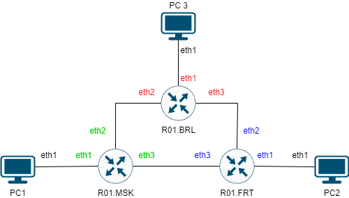
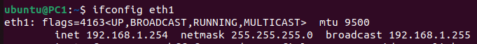
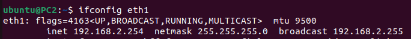
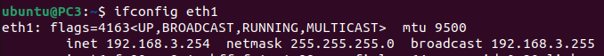
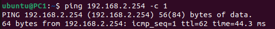
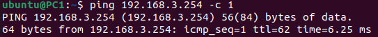
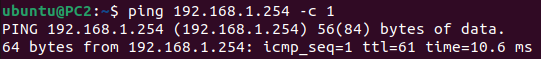
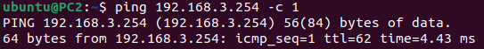
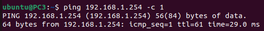
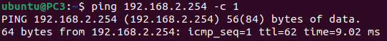

University: [ITMO University](https://itmo.ru/ru/)  
Faculty: [FICT](https://fict.itmo.ru)  
Course: [Introduction in routing](https://github.com/itmo-ict-faculty/introduction-in-routing)  
Year: 2023/2024  
Group: K33212  
Author: Shelyagov Aleksei Sergeevich       
Lab: Lab1  
Date of create: 17.12.2023  
Date of finished: 17.12.2023 

## Лабораторная работ №2 "Эмуляция распределенной корпоративной сети связи, настройка статической маршрутизации между филиалами"

## Цель работы
Ознакомиться с принципами планирования IP адресов, настройке статической маршрутизации и сетевыми функциями устройств

## Ход работы   

Развернем сеть в ContainerLab. Перед запуском сети были созданы контейнеры ```ubuntu:latest```(последняя версия Ubuntu) и ```vrnetlab/vr-routeros:6.47.9```(RouterOS-контейнер)
Также, пропишем config-файлы для Mikrotik'ов и скрипты, настрaивающие Ubunt'ы после запуска:

### Файл, конфигурирующий сеть
```
name: test2

mgmt:
  ipv4-subnet: 172.20.20.0/24


topology:
  nodes:
    RO1.MSK:
      kind: vr-ros
      image: vrnetlab/vr-routeros:6.47.9
      mgmt-ipv4: 172.20.20.11
      startup-config: R01.MSK.cfg
    RO1.FRT:
      kind: vr-ros
      image: vrnetlab/vr-routeros:6.47.9
      mgmt-ipv4: 172.20.20.12
      startup-config: R01.FRT.cfg
    RO1.BRL:
      kind: vr-ros
      image: vrnetlab/vr-routeros:6.47.9
      mgmt-ipv4: 172.20.20.13
      startup-config: R01.BRL.cfg
      
    PC1:
      kind: linux
      image: ubuntu:latest
      mgmt-ipv4: 172.20.20.21
      binds:
        - setup_ubuntu.sh:/tmp/setup.sh
      exec:
        - bash /tmp/setup.sh
    PC2:
      kind: linux
      image: ubuntu:latest
      mgmt-ipv4: 172.20.20.22
      binds:
        - setup_ubuntu.sh:/tmp/setup.sh
      exec:
        - bash /tmp/setup.sh
    PC3:
      kind: linux
      image: ubuntu:latest
      mgmt-ipv4: 172.20.20.23
      binds:
        - setup_ubuntu.sh:/tmp/setup.sh
      exec:
        - bash /tmp/setup.sh
    
  links:
    - endpoints: ["RO1.MSK:eth2", "RO1.BRL:eth2"]
    - endpoints: ["RO1.MSK:eth1", "PC1:eth1"]
    - endpoints: ["RO1.FRT:eth3", "RO1.MSK:eth3"]
    - endpoints: ["RO1.FRT:eth1", "PC2:eth1"]
    - endpoints: ["RO1.BRL:eth3", "RO1.FRT:eth2"]
    - endpoints: ["RO1.BRL:eth1", "PC3:eth1"]
```


### Полученная топология сети



### Скрипт для настройкки Ubuntu
(Также, заранее сгенерировал ssh-ключи и поместил публчный в этот скрипт)
```
#!/bin/bash
mkdir /root/.ssh
echo 'ssh-ed25519 AAAAC3NzaC1lZDI1NTE5AAAAIAO8lVSwDTQ11hg2FWAQmCMPI1yLzVLdYxkE0n4QvyIq' >> /root/.ssh/authorized_keys
chmod 600 /root/.ssh/authorized_keys

apt-get update > /dev/null

DEBIAN_FRONTEND=noninteractive apt-get install -y iproute2 iputils-ping sudo net-tools isc-dhcp-client openssh-server mtr > /dev/null

echo "ubuntu" | sudo adduser "ubuntu"
echo  "ubuntu:ubuntu" | sudo chpasswd

usermod -aG sudo "ubuntu"
service ssh start

suod dhclient eth1
```
### Config-файл для московского роутера(R01.MSK):
```
/ip address
add address=192.168.1.1/24 interface=ether2 network=192.168.1.0
add address=192.168.11.1/24 interface=ether3 network=192.168.11.0
add address=192.168.12.2/24 interface=ether4 network=192.168.12.0

/ip pool
add name=dhcp_pool0 ranges=192.168.1.2-192.168.1.254

/ip dhcp-server
add address-pool=dhcp_pool0 disabled=no interface=ether2 name=dhcp1

/ip dhcp-server option
add code=121 name=MSK121 value=0x10C0A8C0A80101

/ip dhcp-server network
add address=192.168.1.0/24 dhcp-option=MSK121 gateway=192.168.1.1


/ip route
add distance=1 dst-address=192.168.2.0/24 gateway=192.168.11.2
add distance=1 dst-address=192.168.3.0/24 gateway=192.168.12.1
```

### Config-файл для берлинского роутера(R01.BRL):
```
/ip address
add address=192.168.3.1/24 interface=ether2 network=192.168.3.0
add address=192.168.11.2/24 interface=ether3 network=192.168.11.0
add address=192.168.13.1/24 interface=ether4 network=192.168.13.0

/ip pool
add name=dhcp_pool0 ranges=192.168.3.2-192.168.3.254

/ip dhcp-server
add address-pool=dhcp_pool0 disabled=no interface=ether2 name=dhcp1

/ip dhcp-server option
add code=121 name=BRL121 value=0x10C0A8C0A80301

/ip dhcp-server network
add address=192.168.3.0/24 dhcp-option=BRL121 gateway=192.168.3.1

/ip route
add distance=1 dst-address=192.168.1.0/24 gateway=192.168.11.1
add distance=1 dst-address=192.168.2.0/24 gateway=192.168.13.2
```

### Config-файл для франкфуртского роутера(R01.FRT):
```
/ip address
add address=192.168.2.1/24 interface=ether2 network=192.168.2.0
add address=192.168.13.2/24 interface=ether3 network=192.168.13.0
add address=192.168.12.1/24 interface=ether4 network=192.168.12.0

/ip pool
add name=dhcp_pool0 ranges=192.168.2.2-192.168.2.254

/ip dhcp-server
add address-pool=dhcp_pool0 disabled=no interface=ether2 name=dhcp1

/ip dhcp-server option
add code=121 name=FRT121 value=0x10C0A8C0A80201

/ip dhcp-server network
add address=192.168.2.0/24 dhcp-option=FRT121 gateway=192.168.2.1

/ip route
add distance=1 dst-address=192.168.1.0/24 gateway=192.168.12.2
add distance=1 dst-address=192.168.3.0/24 gateway=192.168.13.1
```

### Проверка правильности настройкки:
Проверка работы dhcp-серверов:





Проверка доступности роутеров из разных сетей:
  PC1:


  PC2:


  PC3:




## Вывод
В результате лабораторной работы удалось ознакомиться с принципами планирования IP адресов, настройке статической маршрутизации и сетевыми функциями устройств.
