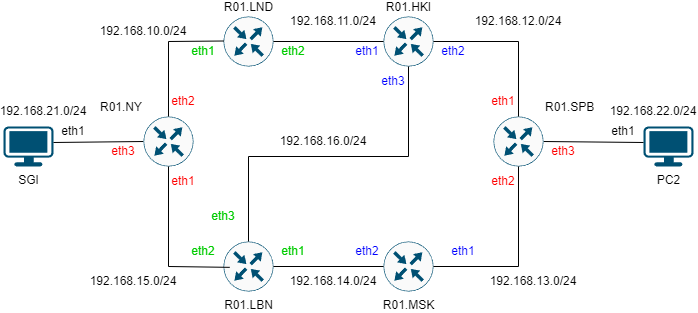
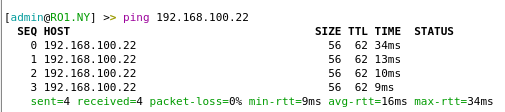
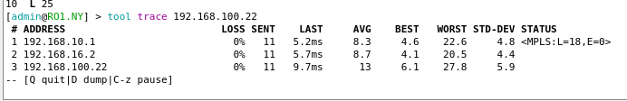
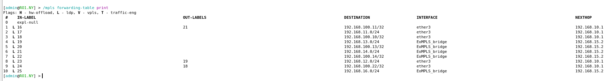

University: [ITMO University](https://itmo.ru/ru/)  
Faculty: [FICT](https://fict.itmo.ru)  
Course: [Introduction in routing](https://github.com/itmo-ict-faculty/introduction-in-routing)  
Year: 2023/2024  
Group: K33212  
Author: Shelyagov Aleksei Sergeevich       
Lab: Lab3  
Date of create: 25.12.2023  
Date of finished: 25.12.2023 

## Лабораторная работ №3 "Эмуляция распределенной корпоративной сети связи, настройка статической маршрутизации между филиалами"

## Цель работы
Изучить протоколы OSPF и MPLS, механизмы организации EoMPLS

## Ход работы   

Развернем сеть в ContainerLab. Перед запуском сети были созданы контейнеры ```ubuntu:latest```(последняя версия Ubuntu) и ```vrnetlab/vr-routeros:6.47.9```(RouterOS-контейнер)
Также, пропишем config-файлы для Mikrotik'ов и скрипты, настрaивающие Ubunt'ы после запуска:

### Файл, конфигурирующий сеть
```
name: test3

mgmt:
  ipv4-subnet: 172.20.20.0/24


topology:
  nodes:
    RO1.MSK:
      kind: vr-ros
      image: vrnetlab/vr-routeros:6.47.9
      mgmt-ipv4: 172.20.20.11
      startup-config: R01.MSK.cfg
    RO1.LBN:
      kind: vr-ros
      image: vrnetlab/vr-routeros:6.47.9
      mgmt-ipv4: 172.20.20.12
      startup-config: R01.LBN.cfg
    RO1.LND:
      kind: vr-ros
      image: vrnetlab/vr-routeros:6.47.9
      mgmt-ipv4: 172.20.20.13
      startup-config: R01.LND.cfg
    RO1.HKI:
      kind: vr-ros
      image: vrnetlab/vr-routeros:6.47.9
      mgmt-ipv4: 172.20.20.14
      startup-config: R01.HKI.cfg
    RO1.NY:
      kind: vr-ros
      image: vrnetlab/vr-routeros:6.47.9
      mgmt-ipv4: 172.20.20.15
      startup-config: R01.NY.cfg
    RO1.SPB:
      kind: vr-ros
      image: vrnetlab/vr-routeros:6.47.9
      mgmt-ipv4: 172.20.20.16
      startup-config: R01.SPB.cfg
      
      
    PC1:
      kind: linux
      image: ubuntu:latest
      mgmt-ipv4: 172.20.20.21
      binds:
        - setup_ubuntu.sh:/tmp/setup.sh
      exec:
        - bash /tmp/setup.sh
    SGI:
      kind: linux
      image: ubuntu:latest
      mgmt-ipv4: 172.20.20.22
      binds:
        - setup_ubuntu.sh:/tmp/setup.sh
      exec:
        - bash /tmp/setup.sh

    
  links:
    - endpoints: ["RO1.SPB:eth3", "PC1:eth1"]
    - endpoints: ["RO1.NY:eth3", "SGI:eth1"]
    - endpoints: ["RO1.NY:eth2", "RO1.LND:eth1"]
    - endpoints: ["RO1.LND:eth2", "RO1.HKI:eth1"]
    - endpoints: ["RO1.HKI:eth2", "RO1.SPB:eth1"]
    - endpoints: ["RO1.SPB:eth2", "RO1.MSK:eth1"]
    - endpoints: ["RO1.MSK:eth2", "RO1.LBN:eth1"]
    - endpoints: ["RO1.LBN:eth2", "RO1.NY:eth1"]
    - endpoints: ["RO1.LBN:eth3", "RO1.HKI:eth3"]
```


### Полученная топология сети



### Скрипт для настройкки Ubuntu
(Также, заранее сгенерировал ssh-ключи и поместил публчный в этот скрипт)
```
#!/bin/bash
mkdir /root/.ssh
echo 'ssh-ed25519 AAAAC3NzaC1lZDI1NTE5AAAAIAO8lVSwDTQ11hg2FWAQmCMPI1yLzVLdYxkE0n4QvyIq' >> /root/.ssh/authorized_keys
chmod 600 /root/.ssh/authorized_keys

apt-get update > /dev/null

DEBIAN_FRONTEND=noninteractive apt-get install -y iproute2 iputils-ping sudo net-tools isc-dhcp-client openssh-server mtr > /dev/null

echo "ubuntu" | sudo adduser "ubuntu"
echo  "ubuntu:ubuntu" | sudo chpasswd

usermod -aG sudo "ubuntu"
service ssh start

suod dhclient eth1
```
### Config-файл для роутера R01.HKI:
```
/interface bridge
add name=loopback


/routing ospf instance
set [ find default=yes ] router-id=192.168.100.11 

/ip address
add address=192.168.11.1/24 interface=ether2 network=192.168.11.0
add address=192.168.12.2/24 interface=ether3 network=192.168.12.0
add address=192.168.16.2/24  interface=ether4 network=192.168.16.0
add address=192.168.100.11 interface=loopback network=192.168.100.11 

/mpls ldp
set enabled=yes transport-address=192.168.100.11 

/mpls ldp interface
add interface=ether2
add interface=ether3
add interface=ether4

/routing ospf network
add area=backbone
```
### Config-файл для роутера R01.LBN:
```
/interface bridge
add name=loopback


/routing ospf instance
set [ find default=yes ] router-id=192.168.100.14 

/ip address
add address=192.168.14.1/24 interface=ether2 network=192.168.14.0
add address=192.168.15.2/24 interface=ether3 network=192.168.15.0
add address=192.168.16.1/24  interface=ether4 network=192.168.16.0
add address=192.168.100.14 interface=loopback network=192.168.100.14 

/mpls ldp
set enabled=yes transport-address=192.168.100.14 

/mpls ldp interface
add interface=ether2
add interface=ether3
add interface=ether4

/routing ospf network
add area=backbone
```

### Config-файл для роутера R01.LND:
```
/interface bridge
add name=loopback


/routing ospf instance
set [ find default=yes ] router-id=192.168.100.10 

/ip address
add address=192.168.10.1/24 interface=ether2 network=192.168.10.0
add address=192.168.11.2/24 interface=ether3 network=192.168.11.0
add address=192.168.100.10 interface=loopback network=192.168.100.10 

/mpls ldp
set enabled=yes transport-address=192.168.100.10 

/mpls ldp interface
add interface=ether2
add interface=ether3

/routing ospf network
add area=backbone
```

### Config-файл для роутера R01.MSK:
```
/interface bridge
add name=loopback


/routing ospf instance
set [ find default=yes ] router-id=192.168.100.13 

/ip address
add address=192.168.13.1/24 interface=ether2 network=192.168.13.0
add address=192.168.14.2/24 interface=ether3 network=192.168.14.0
add address=192.168.100.13 interface=loopback network=192.168.100.13

/mpls ldp
set enabled=yes transport-address=192.168.100.13

/mpls ldp interface
add interface=ether2
add interface=ether3

/routing ospf network
add area=backbone
```

### Config-файл для роутера R01.NY:
```
/interface bridge
add name=EoMPLS_bridge
add name=loopback

/interface vpls
add cisco-style=yes cisco-style-id=100 disabled=no l2mtu=1500 mac-address=0C:00:45:9A:DB:03 name=EoMPLS remote-peer=192.168.100.22

/routing ospf instance
set [ find default=yes ] router-id=192.168.100.21

/interface bridge port
add bridge=EoMPLS_bridge interface=ether2
add bridge=EoMPLS_bridge interface=EoMPLS

/ip address
add address=192.168.15.1/24 interface=ether2 network=192.168.15.0
add address=192.168.10.2/24 interface=ether3 network=192.168.10.0
add address=192.168.100.21 interface=loopback network=192.168.100.21

/mpls ldp
set enabled=yes transport-address=192.168.100.21

/mpls ldp interface
add interface=ether3
add interface=ether4

/routing ospf network
add area=backbone
```

### Config-файл для роутера R01.SPB:
```
/interface bridge
add name=EoMPLS_bridge
add name=loopback

/interface vpls
add cisco-style=yes cisco-style-id=100 disabled=no l2mtu=1500 mac-address=0C:00:39:DF:91:01 name=EoMPLS remote-peer=192.168.100.21

/routing ospf instance
set [ find default=yes ] router-id=192.168.100.22

/interface bridge port
add bridge=EoMPLS_bridge interface=ether4
add bridge=EoMPLS_bridge interface=EoMPLS

/ip address
add address=192.168.12.1/24 interface=ether2 network=192.168.12.0
add address=192.168.13.2/24 interface=ether3 network=192.168.13.0
add address=192.168.100.22 interface=loopback network=192.168.100.22

/mpls ldp
set enabled=yes transport-address=192.168.100.22

/mpls ldp interface
add interface=ether2
add interface=ether3

/routing ospf network
add area=backbone
```


### Проверка правильности настройки:
В результате проверки можно убедиться, что все устройства соединены и функционируют в соответствии с заданием






## Вывод
В результате лабораторной работы удалось ознакомиться с принципами работы протоколов OSPF и MPLS.
